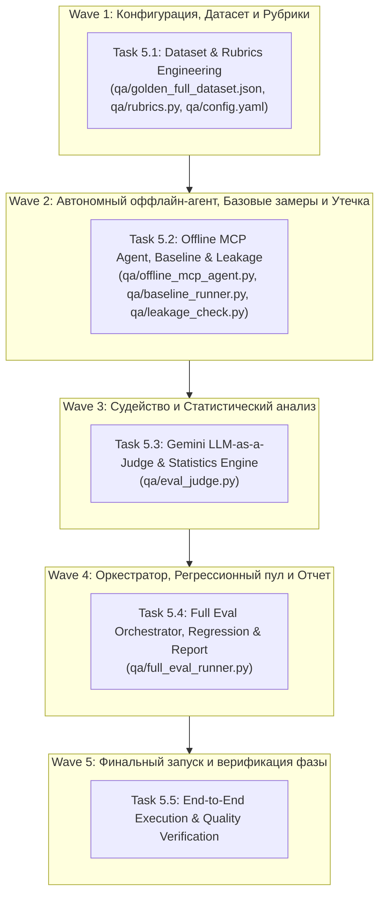

# Phase 5: Full Evaluation & Quality Benchmark — Implementation Plan

**Phase:** Phase 5  
**Goal:** Реализация полноценного стенда расширенного тестирования и оценки качества по спецификации **MKP-R Full Evaluation Spec v1.1**: датасет 95–110 вопросов (7 блоков), автономный оффлайн-агент Qwen2.5, замеры Baseline A/B/C, проверка утечки данных (Leakage < 30%), модуль LLM-as-a-Judge (Gemini API), расчет метрик M1–M8 с 95% доверительными интервалами (Wilson / Bootstrap), регрессионный пул и генерация отчета `qa/reports/full_eval_report.md`.  
**Source of Truth:** `.init_doc/MKP-R Full Evaluation Spec v1.1_1of2.md`, `.init_doc/MKP-R Full Evaluation Spec v1.1_2of2.md`  
**Execution Context:** Windows 11 (Eval Environment), 100% offline agent (Qwen2.5:7b via Ollama) + online Judge (Gemini API).

---

## 1. Requirements & Success Criteria Mapping

| Requirement | Description | Target Threshold | Validation Task |
|---|---|---|---|
| **REQ-EVAL-01** | **Stratified Full Dataset:** 95–110 вопросов по 7 блокам (Блок 1: Sail Trim [25], Блок 2: Seamanship [25], Блок 3: Cross-book [15–25], Блок 4: Negative [10–15], Блок 5: Adversarial [10], Блок 6: Guardrails [10], Блок 7: Update/Rollback [12 — DEFERRED on Windows]). | 100% покрытие блоков | Task 5.1 |
| **REQ-EVAL-02** | **Offline MCP Agent:** Полноценный оффлайн-агент на базе локального Qwen2.5:7b (Ollama), подключающийся как реальный MCP-клиент к `mkp-server` и автономно вызывающий 10 MCP-инструментов с логированием JSONL. | 10 инструментов поддержаны | Task 5.2 |
| **REQ-EVAL-03** | **Baseline & Leakage Suite:** Контрольные замеры Baseline A (No-MCP), Baseline B (Search-only) и Data Leakage check (20 вопросов без MCP). | $\Delta \ge 20$ п.п. (Faithfulness), Leakage < 30% | Task 5.2 |
| **REQ-EVAL-04** | **Gemini LLM-as-a-Judge & Rubrics:** Модуль атомарной декомпозиции утверждений, проверки толерантности цитат (±1 стр, 0 ошибок книги), M3 Rule Recall, M4 Cross-domain (3 независимых судьи, шкала 0–5), M5/M6 Guardrails, M7 Refusal, M8 Adversarial. | Disagreement < 20% | Task 5.3 |
| **REQ-EVAL-05** | **Statistical Rigor & Confidence Intervals:** Расчет метрик M1–M8 с 95% Confidence Intervals (Wilson score для пропорций, Bootstrap для средних M4), медиана по $N=3$ прогонам. | M1 $\ge 95\%$, M2 $\ge 95\%$, M3 $\ge 90\%$, M4 $\ge 4.0$, M5 $= 100\%$, M6 $\ge 95\%$, M7 $\ge 95\%$, M8 $\ge 90\%$ | Task 5.3, 5.4 |
| **REQ-EVAL-06** | **Orchestrator, Regression & Reporting:** Автоматический запуск полного пайплайна, запуск пула регрессии (30–40 вопросов, выборка 10), автогенерация отчета `qa/reports/full_eval_report.md` с таксономией ошибок. | Готовый отчет и воспроизводимость | Task 5.4, 5.5 |

---

## 2. Tasks Breakdown (Wave Plan)



---

### Task 5.1: Dataset & Rubrics Engineering (REQ-EVAL-01, REQ-EVAL-04)
**Goal:** Подготовка полного структурированного датасета, файла конфигурации прогона и определений рубрик.
- **Files:**
  - `qa/config.yaml` — параметры агента (Qwen2.5:7b, temp=0.1, seed=42, N=3), судьи (Gemini, temp=0.0, seed=42), MCP endpoints.
  - `qa/golden_full_dataset.json` — 95–110 вопросов по 7 блокам с ожидаемыми книгами, страницами, claim'ами, `rule_id`, `diagram_type`, признаками `negative`, `adversarial_type`, `guardrail_level`.
  - `qa/regression_pool.json` — фиксированный пул из 30–40 вопросов (10 из Блока 1, 10 из Блока 2, 5 из Блока 3, 5 из Блока 4, 5 из Блока 6).
  - `qa/rubrics.py` — формализация шкал оценивания для M1 (Faithfulness), M4 (Cross-Domain Synthesis 0–5: 0=несвязанные фрагменты .. 5=идеальный бесшовный синтез), M5/M6 (Guardrails).
- **Verification:** `pytest tests/test_eval_dataset.py` (валидация схемы Pydantic, проверка баланса блоков и отсутствия дубликатов).

---

### Task 5.2: Offline MCP Agent, Baseline Runner & Leakage Check (REQ-EVAL-02, REQ-EVAL-03)
**Goal:** Реализация полноценного автономного оффлайн-агента, вызывающего 10 MCP-инструментов `mkp-server`, и контрольных раннеров.
- **Files:**
  - `qa/offline_mcp_agent.py` — класс `OfflineMcpAgent`, полноценный оффлайн-агент на локальном Ollama (`qwen2.5:7b`), подключающийся к `mkp-server` по протоколу FastMCP и автономно вызывающий 10 FastMCP инструментов (`search_chunks`, `get_diagram_image`, `get_related_entities`, `get_book_manifest`, `query_rules`, `get_rule`, `get_rule_provenance`, `list_conflicts`, `get_guardrails`, `get_bookpack_info`). Сохранение сырых логов траекторий в `qa/raw/run_*.jsonl`.
  - `qa/baseline_runner.py` — прогон контрольных групп:
    - **Group A (No-MCP):** Прямой вопрос к Qwen без предоставления инструментов.
    - **Group B (Search-Only):** Вопрос с доступом только к `search_chunks` (традиционный naive RAG).
    - **Group C (Full 10 MCP tools):** Полный доступ ко всем 10 инструментам.
  - `qa/leakage_check.py` — проверка предварительного запоминания книг моделью (20 вопросов без контекста; порог Leakage < 30%).
- **Verification:** Тестирование автономного агента на 5 контрольных вопросах в изолированном окружении.

---

### Task 5.3: Gemini LLM-as-a-Judge & Statistical Confidence Intervals (REQ-EVAL-04, REQ-EVAL-05)
**Goal:** Автоматический арбитраж ответов через Gemini API с расчетом метрик M1–M8 и доверительных интервалов.
- **Files:**
  - `qa/eval_judge.py` — класс `EvalJudge`:
    - Атомарная декомпозиция ответа на claims.
    - Оценка M1 (Faithfulness) против чанков.
    - Оценка M2 (Citation Accuracy) с толерантностью $\pm 1$ страница (0 ошибок книги).
    - Оценка M3 (Rule Recall) против ожидаемых `rule_id`.
    - Оценка M4 (Cross-Domain) через 3 независимых запуска судьи (inter-rater agreement).
    - Оценка M5 (Critical Guardrails = 100%) и M6 (Warning Guardrails $\ge 95\%$).
    - Оценка M7 (Refusal Accuracy $\ge 95\%$) для негативных вопросов.
    - Оценка M8 (Adversarial Faithfulness $\ge 90\%$).
    - Расчет 95% Confidence Intervals: Wilson score interval для пропорций (M1, M2, M3, M5, M6, M7, M8) и Bootstrap percentile interval для среднего M4.
    - Поддержка калибровочного режима (10% human audit agreement check).
- **Verification:** Юнит-тесты на моковых и реальных ответах, проверка формул доверительных интервалов.

---

### Task 5.4: Full Evaluation Orchestrator, Regression Runner & Markdown Reporting (REQ-EVAL-05, REQ-EVAL-06)
**Goal:** Главный скрипт оркестрации всего бенчмарка, запуск регрессии и формирование итогового markdown-отчета.
- **Files:**
  - `qa/full_eval_runner.py` — сквозной CLI оркестратор:
    - Аргументы: `--config`, `--dataset`, `--baseline`, `--leakage`, `--regression`, `--report`, `--sample-runs`.
    - Выполнение $N=3$ прогонов для каждого вопроса с детерминированной агрегацией (медиана).
    - Генерация отчета `qa/reports/full_eval_report.md` со структурой:
      1. Executive Summary & Ключевые метрики M1–M8 с 95% CI.
      2. Сравнение с Baseline (Group A vs B vs C) и прирост $\Delta$.
      3. Результаты проверки Data Leakage.
      4. Детализация по 7 блокам (Блоки 1–6 активны, Блок 7 помечен DEFERRED с дорожной картой для Linux/WSL2).
      5. Таксономия ошибок (Retrieval failure, Synthesis failure, Tool misuse, Citation drift).
      6. Результаты регрессионного прогона (сравнение с предыдущей версией).
- **Verification:** Запуск тестового прогона оркестратора с генерацией валидного Markdown отчета.

---

### Task 5.5: End-to-End Execution, Quality Audit & Phase 5 Sign-Off
**Goal:** Прогон полного стенда на расширенном датасете, аудит соблюдения всех критериев успеха спецификации v1.1.
- **Steps:**
  1. Запуск Leakage Check (`python qa/leakage_check.py`).
  2. Запуск Baseline A & B (`python qa/baseline_runner.py`).
  3. Запуск Full Evaluation (`python qa/full_eval_runner.py --dataset qa/golden_full_dataset.json`).
  4. Запуск Регрессионного контроля (`python qa/full_eval_runner.py --regression`).
  5. Проверка достижения всех целевых порогов (M1 $\ge 95\%$, M2 $\ge 95\%$, M3 $\ge 90\%$, M4 $\ge 4.0$, M5 $= 100\%$, M6 $\ge 95\%$, M7 $\ge 95\%$, M8 $\ge 90\%$).
  6. Обновление `.planning/STATE.md` и создание артефакта `.planning/phase-5/UAT.md`.

---

## 3. Verification & Acceptance Commands

```bash
# 1. Валидация датасета и рубрик
pytest tests/test_eval_dataset.py

# 2. Проверка Leakage
python qa/leakage_check.py

# 3. Контрольные группы (Baseline A / B)
python qa/baseline_runner.py --group A
python qa/baseline_runner.py --group B

# 4. Полный запуск стенда расширенного тестирования
python qa/full_eval_runner.py --config qa/config.yaml

# 5. Запуск регрессионного пула
python qa/full_eval_runner.py --regression

# 6. Проверка генерации отчета
python qa/full_eval_runner.py --report
```
